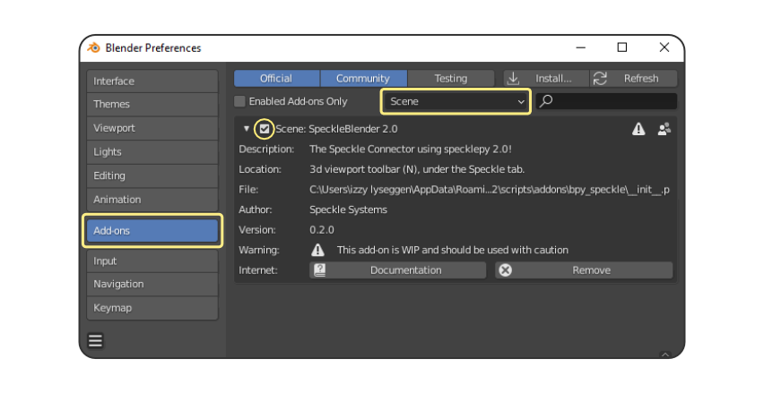
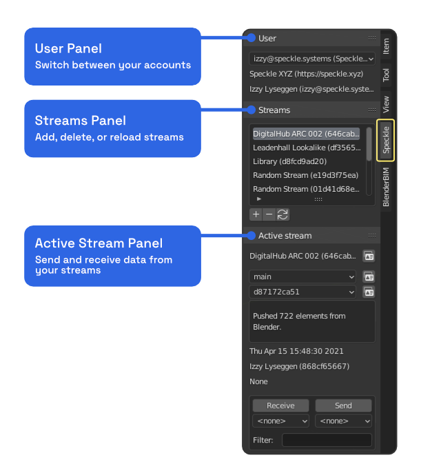

# Blender

::: tip DISCLAIMER 🐉
This connector is in early alpha and has limited functionality.
It should be used with caution on non-sensitive projects.
There will be breaking changes!
:::

## Installation

The Blender Connector can be installed by following the instructions for the [Speckle Manager](/user/manager). 

Once the connector has been installed, you will find it in the Add-ons tab of your Preferences under the "Scene" category. Activate it by checking the tick box next to the Add-on name.

## User Interface

The Blender Connector lives in the 3D viewport toolbar (N) under the Speckle tab. It contains three main panels: 

- **User Panel** for switching between different local accounts
- **Streams Panel** for browsing your existing streams, creating new streams, or deleting old streams
- **Active Stream Panel** for sending and receiving data to and from Speckle

The **Streams Panel** shows a list of your most recent streams which you can search through by name. You can add new streams with the "➕" button, delete streams with the "➖" button, and refresh the streams with the "🔄" button.

The **Active Stream Panel** will show more details about the stream you've selected from the Streams Panel. From here, you can change the active branch and commit. You can also Send and Receive any items you have selected in Blender. Under the Send and Receive buttons, you can use the dropdown menus to select a script to run on all elements during the send / receive process. At the very bottom of the panel (not pictured), you'll find a button that will open the stream in the web.

## Sending & Receiving

For a quick overview, check out this short video on how to get started sending and receiving data from Blender!

<iframe width="560" height="315" src="https://www.youtube.com/embed/vy-i6lCdMOE" title="YouTube video player" frameborder="0" allow="accelerometer; autoplay; clipboard-write; encrypted-media; gyroscope; picture-in-picture" allowfullscreen></iframe>

## Supported Elements

The Blender Connector is still a work in progress and as such, the conversions to and from Speckle are not yet robust. We welcome feedback, requests, edge cases, and contributions!

- Meshes are fairy well supported
- Breps are imported as meshes using their `displayValue`
- Curves have limited support

| Type                                     | Send | Receive      | Status        |
| ---------------------------------------- | ---- | ------------ | ------------- |
| Arc                                      |      | approximated | `In Progress` |
| Brep                                     |      | as mesh      | `In Progress` |
| Curve (Nurbs, Bezier, Ngons as Polyline) | x    | x            | `In Progress` |
| Mesh                                     | x    | x            | `In Progress` |
| Polycurve                                |      | x            | `In Progress` |
| Polyline                                 | x    | x            | `In Progress` |
| Render Material                          | x    | x            | `In Progress` |

## Developing Locally

If you'd like to help develop this connector further, you can pull from the [github repo here](https://github.com/specklesystems/speckle-blender). 

To run your local version of the connector, drag the `bpy_speckle` folder from the `speckle-blender` directory into your Blender `addons` folder replacing any previous version you may have in there. This will be at `%APPDATA%/Blender Foundation/Blender/2.92/scripts/addons`. If you haven't installed the connector before, you'll need to manually go into the `addons/modules` folder and install the dependencies there. 