## Grasshopper Connector

Once installed, the **Grasshopper Connector** will appear under the `Speckle 2` tab, or if you use _tab icons_ you'll see our new Speckle logo instead.

The connector is divided into 3 main categories:

- Send/Receive
- Object management
- Streams & Accounts

You'll also find 2 extra categories marked as `Dev`. These categories hold nodes designed for advanced users and developers:

- Dev/Conversion: Conversion + serialization nodes.
- Dev/Transports: Not sure what transports are? Read up on [XXX](https://XXX)

### Sending Data

Let's look at how we would send some data in grasshopper. First, start by creating a new `Send` node.

In order to send some data to the server, we will also need to _create a stream_. We can do this by double clicking the canvas and searching for the `Stream Create` node. This node requires an account as an input, so we will also need to create an `Accounts` node.

Once you've got the three nodes in your canvas, you are ready to get started!

#### Creating a stream

Select the desired account from the dropdown and connect it to the `Stream Create` node.

If the stream creation was successfull, the output of the node should be a _stream url_ pointing to the newly created stream and linked to the specified account.

#### Adding objects

In order to select which objects to send in grasshopper, we just need to connect the desired nodes to the `Data` input in the `Send` node. The sender supports any type of data, in any structure (item, list, datatree), and will convert any Rhino objects into a Speckle compatible format when necessary.

#### Sending data

The only thing left to do is to connect the `Stream Create` output to the `Stream` input in the `Send` node, and then press the **Send button**.

You should see the progress report in the lower side of the Send node, and once finished, you will get a notification with some basic info.

To view the data you just sent in Grasshopper, just right-click the `Send` node and select the `View commit ...` option. This should open a new browser window loading the _stream url_. You can share that url with any collaborators so they can receive the data.

### Receiving Data

Receiving data is a very simple operation. You just need to create a `Receive` node, and connect to it a panel with the _stream url_ we obtained from the send operation.

### Creating custom objects

There's several different ways to create custom speckle objects using the Grasshopper. One of them is using the `Create Speckle Object` node.

This node has _variable input parameters_, meaning that you can modify the ammount of input nodes it has by zooming into the component.

You can also modify the name of this inputs by right-clicking the input name. In the right-click menu, you will also find the options to change the **access type** of that input. Meaning, if the object property should be a single item, or a list.

### Using Streams in GH

> If you want to know more about streams, go [here](./concepts.md#streams) 👈

In _Grasshopper_, you can work with streams in several ways. All nodes that accept `Streams` as input, or that output `Streams` as a result, will be identified by the **Stream Parameter** icon.

You can also instantiate a stream by copy/pasting the stream url from your server into a `Panel`.

#### Working with branches

Branches cannot be created or directly selected in the Grasshopper connector, but all `Stream` type inputs accept _branch url's_ that you can copy directly from the server's website.

> Want to know more about `branches` in Speckle? Go [here](./concepts.md#branches) 👈

### Object conversion and Kits

Speckle 2.0 comes with one Kit pre-installed, the `Objects Kit`. This kit is in charge of all conversions to and from Speckle, but other kits may be introduced in the future, leaving the decision to choose which kit to use at each given time to the end-user.

Once a document is open in Grasshopper, you will find a `Speckle 2` application menu that will allow you to specify the appropriate kit to use by default.

This will set the kit to be used by any newly created components in your Grasshopper canvas.

When necessary, you can always adjust the kit being used at each individual component by right-clicking it. The _right-click_ menu should display the same kit selection items. This menu should be available on any component that performs object conversions (most object-management, send, receive...).

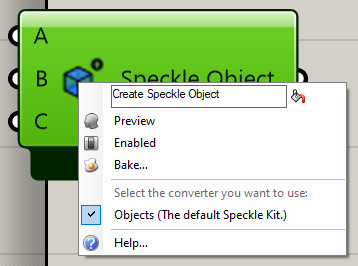

You can also distinguish them by the message displaying the selected kit under the component.

### Nodes

#### Send/Receive

##### Send node

The **Send node** performs sending operations, usually to a Speckle Server, but also supports sending to a different data storage using _transports_. Whenever possible, the _Send_ node wil try to convert any Rhino-compatible objects into Speckle format.

There is also an option to set the node to automátically send every time there is a change in the data. You will find this option in the right-click menu of the node.

| 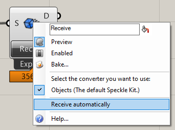 | 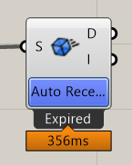 |
| ------------------------------------------------------------------------- | ------------------------------------------------------------------------ |

This node is capable of [Kit Selection](#object-conversion-and-kits)

###### Input

- _Data_: This port will accept almost anything you give it. If the objects provided are not `Base` objects, it will also perform the conversion to Speckle automatically.
- _Stream_: Supports any generated stream from within the `Stream` component category, but also _stream urls_ in text format.
- _Message_: The message you want to attach to the _commit_ when you send the data. Defaults to `"Grasshopper push"`.

###### Output

- _Stream_: The _commit url_ pointing to the objects in the Speckle server.

##### Receive node

The **Receive node** fetches data from a specified `Stream` or any other valid `Transport`. Whenever possible, the receiver node will try to convert all Speckle objects into Rhino-compatible objects.

This node is capable of [Kit Selection](#object-conversion-and-kits)

###### Inputs

- _Stream_: Supports any generated stream from within the `Stream` component category, but also _stream urls_ in text format.

###### Outputs

- _Data_: The data that was received from the stream.

##### Local Send node

The **Local Send** node performs sending operations directly to the users's local database.

This node is capable of [Kit Selection](#object-conversion-and-kits)

###### Inputs

- _Data_: The data to be sent locally. This port will accept almost anything you give it. If the objects provided are not `Base` objects, it will also perform the conversion to Speckle automatically.

###### Outputs

- _localDataId_: The unique `id` for the data that was locally sent.

##### Local receive node

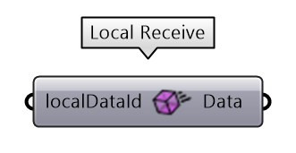

The **Local Receive** node performs receive operations in the same way as the [Receive node](#receive-node), the only difference is that data is received locally from the Speckle's user local database, instead of the server or any other transport.

This node is capable of [Kit Selection](#object-conversion-and-kits)

###### Inputs

- _localDataId_: The unique `id` for the data you want to fetch locally. This would be provided from a [Local Send node](#local-send-node)

###### Outputs

- _Data_: The data thas was received. This port will accept almost anything you give it. If the objects provided are not `Base` objects, it will also perform the conversion to Speckle automatically.

#### Object management

##### Create Speckle Object

The **Create Speckle Object** node allows for the creation of custom objects that can be sent via Speckle. This node is a _variable parameter_ type, meaning if you zoom into the _inputs_ section, you should see a `+/-` sign that will allow you to add/remove properties from the object. You can also modify the name of these properties, as well as their _access type_.

This node is capable of [Kit Selection](#object-conversion-and-kits)

> **Modifying the access type**
>
> Access type operates in the same way as the `Python` and `C#` script components. In this case, you can specify if you want a specific property in the object to be a _list_ or a single _item_.
> i.e. If you plug a list of numbers into a `Create Speckle Object` node, depending on the specified access of that property you will get 2 different results:
>
> - **Item access**: The result will be a **list** of base objects, with only one item each.
>   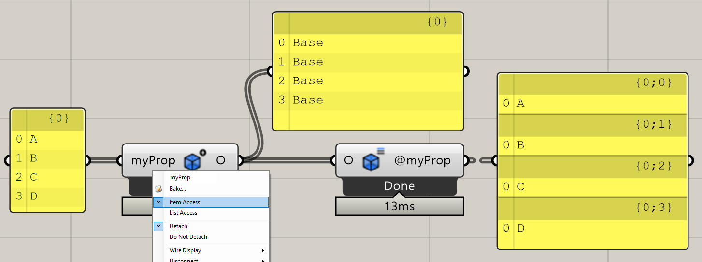
> - **List accesss**: The result will be **one** base object, with the entire list of items saved in the property.
>   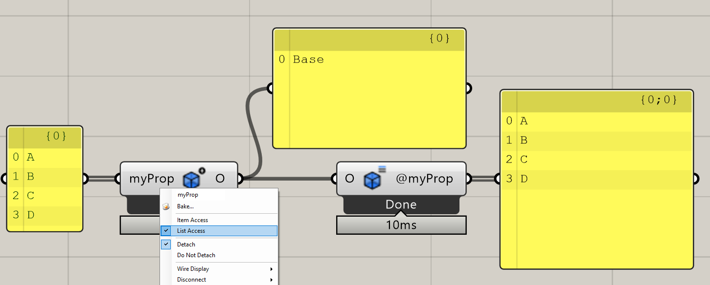

> **Detach/Do not detach**
>
> Every property can also be specified as _detached/non-detached_. When a property is _detached_, it means that the objects it contains will be saved as independent entities in the Speckle database. All properties are detached by default for performance reasons, but you can choose not to by specifying `Do not detach` on the right-click menu.

##### Create Speckle Object by Key/Value pairs

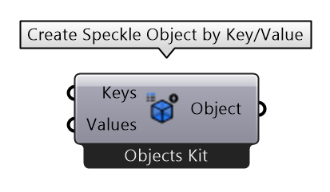

This node will create a new speckle object using a list of `Keys` to be used as the object's properties, and a list of values (or nested list) to assign to each property.

This node is capable of [Kit Selection](#object-conversion-and-kits)

> When using this component, there is no option to specify a properties `detached` state, so all props will be detached by default.

> Notice when creating list items, the data structure must mach. Meaning, the keys and values for each object must start with the same branch index.

##### Expand Speckle Object

The **Expand Speckle Object** works in the exact oposite way as the [Create Speckle Object](#create-speckle-object). When a `Base` object is plugged into the input, it will automatically create the outputs for each of the `Base` objects properties.

This node is capable of [Kit Selection](#object-conversion-and-kits)

###### Inputs

- `Speckle Object`: The speckle object to extract the properties from.

###### Outputs

Outputs are dynamically generated according to the specific Base objects that have to be expanded.
All outputs will appear in alphabetical order regardless on the order they were created/added to the object.

##### Extend Speckle Object

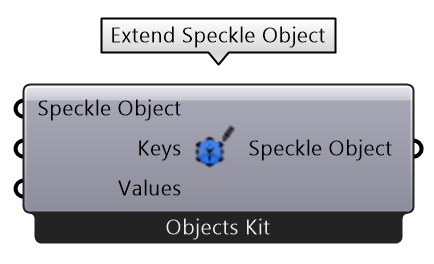

The **Extend Speckle Object** provides a way to add new properties to an already existing `Base` object.

This node is capable of [Kit Selection](#object-conversion-and-kits)

###### Inputs

- _Speckle Object_: The Speckle object to be extended.
- _Keys_: The Keys to extend the object with. When an existing key is overriden, a warning will be displayed.
- _Values_: The values to assign to each individual key. Works in the same way as the [Create Object by KeyValue node](#create-speckle-object-by-keyvalue-pairs)

###### Outputs

- _Speckle Object_: The extended/updated Speckle `Base` object.

##### Schema Builder

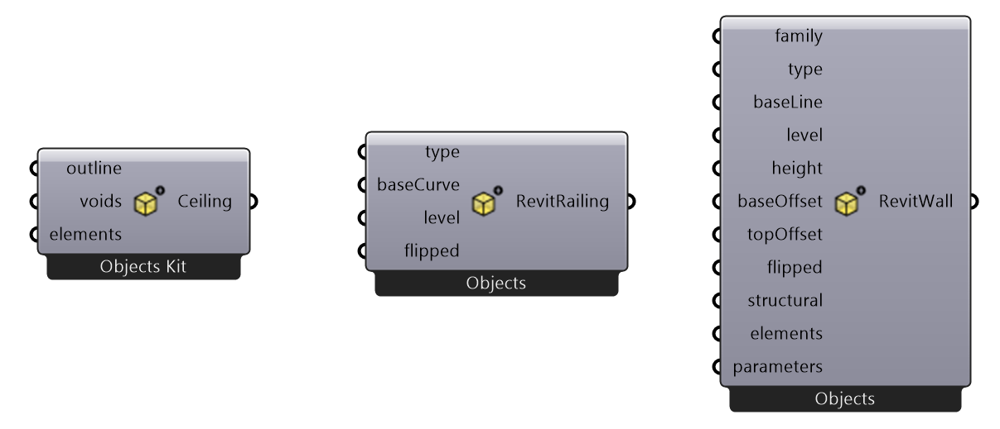

The **Schema Builder** node will allow for the creation of specific custom objects that are supported by the Speckle Objects Kit.

These include mainly building elements to enhance interoperability between Rhino/Grasshopper and other BIM software solutions like Revit.

When a new **Schema Builder** node is created, a pop-up window will be displayed prompting the user to select a specific object schema. This schema will be used to populate the input/output ports of the node with the appropriate fields.

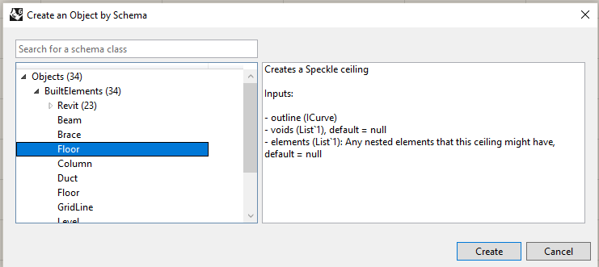

This node is capable of [Kit Selection](#object-conversion-and-kits)

###### Inputs

Inputs are dynamically generated based on the user selected schema.

###### Outputs

Output is dynamically generated based on the user selected schema.

#### Streams & Accounts

##### Accounts node

The **Accounts** node provides a fast way of selecting different Speckle accounts. Uses the native grasshopper

> Accounts must be set-up in your computer using the **Speckle Manager**. If no accounts are shown after setting up the solution

##### Create stream

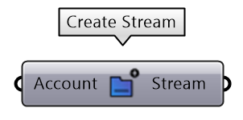

###### Inputs

- _Account_: A Speckle account, provided by the **Accounts node**.

###### Ouputs

- _Stream_: A `Stream` object pointing to the newly created stream.

##### Get stream

The **Stream Get** node will try to find an existing `Stream`, given it's unique `id` (or its `stream url`) and a specific account to access that stream with.

###### Inputs

- _Stream_: Supports any generated stream from within the `Stream` component category, but also _stream urls_ in text format.
- _Account_: A Speckle account, provided by the **Accounts node**. If no account is provided, the _default account_ will be used.

###### Outputs

- _Stream_: A `Stream` object pointing to existing stream. If the stream doesn't exist, an error will be shown.

##### List streams

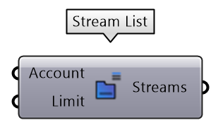

The **List Streams** node returns a specified ammount of streams available in an account. For performance reasons, it has been limited to fetching a maximum of 20 streams.

###### Inputs

- _Account_: A Speckle account, provided by the **Accounts node**. If no account is provided, the _default account_ will be used.
- _Limit_: The number of streams to fetch from the server.

###### Outputs

- _Streams_: List of `Stream` objects available to the specified account.

##### Stream details

The **Stream Details** node returns all relevant information related to a specific `Stream`.

###### Inputs

- _Stream_: Supports any generated stream from within the `Stream` component category, but also _stream urls_ in text format.

###### Output

- _Stream ID_: The unique `id` that identies the stream.
- _Name_: The name of the stream.
- _Description_: The description of the stream.
- _Created at_: The date this stream was created.
- _Updated at_: The date marking the last time the stream was updated.
- _Public_: Boolean value indicating if the stream has _link sharing_ enabled.
- _Collaborators_: A list of collaborators that have access to this stream, as well as their roles.
- _Branches_: A list of available branches for this stream.

##### Stream update

The **Stream Update** node allows for updating the _name_, _description_ and _link sharing_ (which will make your data publicly available to read by anyone with the _stream url_)

###### Inputs

- _Stream_: Supports any generated stream from within the `Stream` component category, but also _stream urls_ in text format.
- _Name (optional)_: Text string with the new name for the stream.
- _Description (optional)_: Text string with the new description for the stream.
- _Public_: Boolean value to activate/deactivate this stream's _link sharing_.

###### Output

- _Stream ID_: A `Stream` url pointing to the updated stream.

#### Dev - Conversion

These nodes where developed exclusively for testing/development purposes. If you don't know what these are, you most likely won't ever need them.

##### Convert to Speckle node

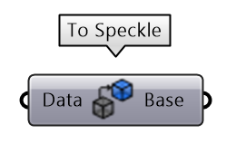

The **Convert to Speckle** node will try to convert any Rhino objects (such as lines, curves, meshes...) into Speckle objects.

This node was developed for testing/development purposes, as any _Kit Selection_-capable component will already perform this conversion step.

##### Convert to Native node

The **Convert to Native** node will try to convert any Speckle objects into Rhino compatible objects.

This node was developed for testing/development purposes, as any _Kit Selection_-capable component will already perform this conversion step.

##### Serialize Speckle objects node

The **Serialize objects** node will convert any Speckle object into `JSON` formatted text.

##### Deserialize Speckle objects node

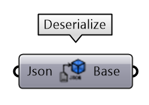

The **Deserialize objects** node will convert a serialized speckle object in json format into `Base` speckle objects.

#### Dev - Transports

**Transports** represent a connection to the specific place your data is being saved to, and can be retreived from.

The most used transport at the moment is the **Server Transport**, as it is used to send and receive data from a specific Speckle server; although others are available too.

##### Server Transport

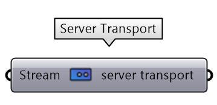

Creates a connection to a specific Speckle Server.

##### SQLite Transport

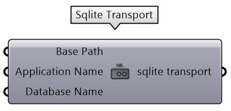

Creates a connection to a specific SQLite database.

##### Disk Transport

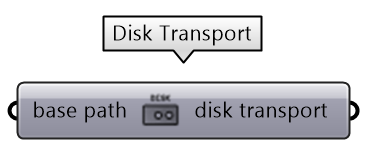

Creates a connection to a specific file in the computer's disk, where the data will be saved in JSON format.

##### Memory Transport

Creates a connection to in-memory storage.
