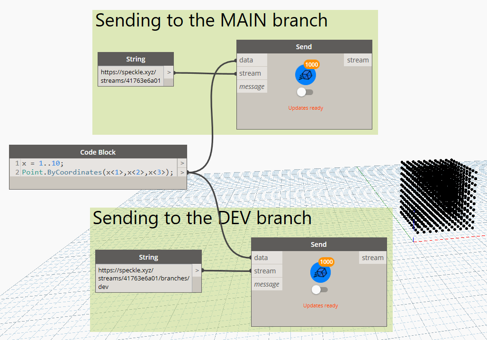
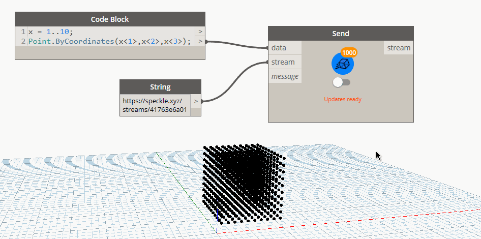
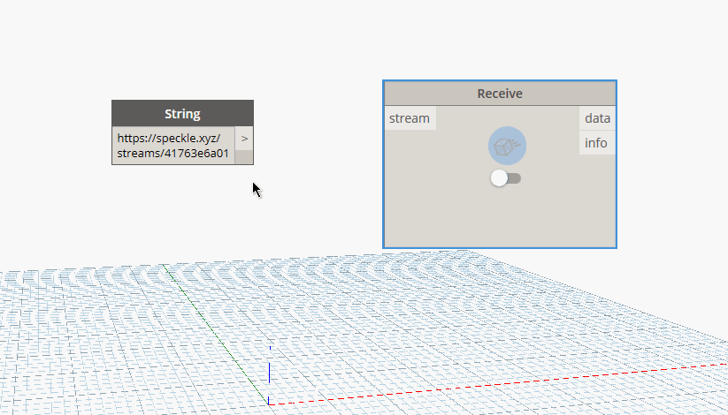
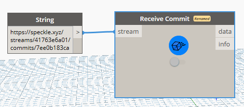
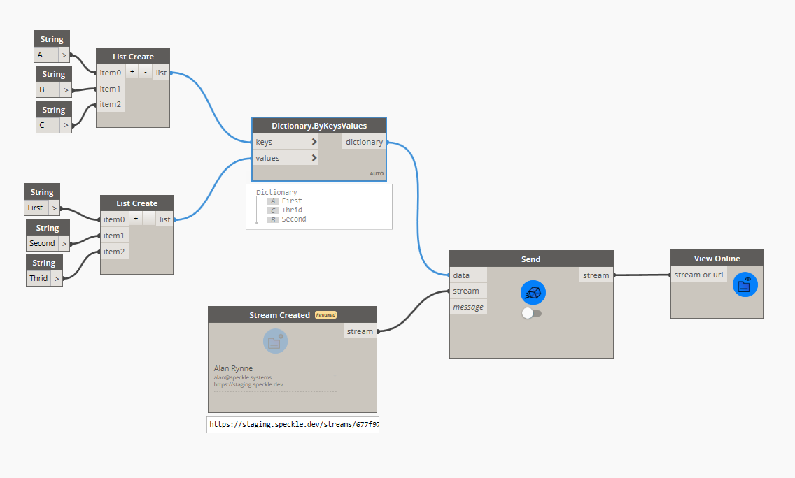
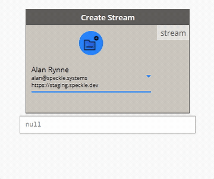
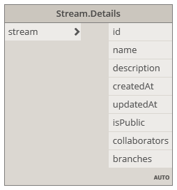
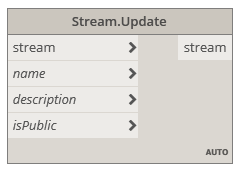
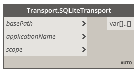

# Dynamo

Speckle currently supports Dynamo versions from 2.1 to 2.8 for Autodesk Revit 2019, 2020 and 2021, as well versions of Dynamo Sandbox from 2.1 to 2.8 are supported.

## Getting Started

To install this connector and add your Speckle account proceed by following the instructions in [Speckle Manager](/user/manager).

Once installed, the **Dynamo Connector** will appear under the `Speckle 2` and `Speckle 2 Dev Tools` tabs.

The `Speckle 2` tab contains the main nodes necessary to operate with Speckle, including send/receive nodes, streams and accounts.

The `Speckle 2 Dev Tools` tabs contain nodes for more advanced use-cases, as well as some handy tools for Speckle developers/hackers.

## Streams and URLs

In visual programming environments, Speckle Streams are now identified by their URLs (instead of their IDs).
Across our Dynamo and Grasshopper connectors you'll see URLs in 3 different formats:

- `https://speckle.xyz/streams/3073b96e86` points to the `main` branch on Stream `3073b96e86`
- `https://speckle.xyz/streams/3073b96e86/branches/dev` points to a branch named `dev` on Stream `3073b96e86`
- `https://speckle.xyz/streams/3073b96e86/commits/604bea8cc6` points to a specific commit `604bea8cc6` on Stream `3073b96e86`
- `https://speckle.xyz/streams/3073b96e86/objects/df7b8bafccefa791d82939dd36541189` points to a specific object `df7b8bafccefa791d82939dd36541189` on Stream `3073b96e86`

::: tip
Unsure about what _commits_ and _branches_ are? No worries, you don't need to know what they are to use Speckle! But if you're curios, you can read about them in [concepts](/user/concepts).
:::

We'll see how branch and commit URLs are used in the following sections.

## Sending Data

Let's look at how we would send some data in Dynamo. First, start by creating a new `Send` node.

In order to select which stream to send data to, you just need to pass a stream URL to the `stream` port.

Alternatively, you can also use one of the following nodes to create / retrieve existing streams:

- [create stream](user/dynamo.md#create-stream)
- [get stream](user/dynamo.md#get-stream)
- [list streams](user/dynamo.md#list-streams)

:::tip NOTE
You cannot send data to a specific commit. Commits represent your stream in a specific point in time and cannot be edited.
:::

#### Adding objects

In order to select which objects to send in Dynamo, we just need to connect the desired node to the `data` input in the `Send` node. The sender will convert any supported Dynamo objects into a Speckle compatible format when necessary.

#### Adding a commit message

It's good practice to add a "commit message" whenever you send you data, especially if working with others, this message should describe the changes being pushed.
You can add a commit message by passing some text to the `message` port.
The commit message will be visible in Speckle Web where you will also be allowed to edit it.

#### Sending

The only thing left to do is to press the **Send button**.

To view the data you just sent from Dynamo online, you can use the `View Online` node. Just plug in the `stream`, `branch` or `commit` URL and click the button.

::: tip
The View Online node is especially useful as data cannot be easily copy/pasted from dynamo nodes
:::

### Sending to a specific branch

When using a stream URL, by default, the `main` branch is used to send and receive data.

To send to a specific branch, simply use the branch URL, ie: `https://speckle.xyz/streams/3073b96e86/branches/dev`.

## Receiving Data

Receiving data is very simple, you just need a `Receive` node, and a stream URL.

When new data is pushed to this stream a notification will appear on the receive node.

### Auto Receiving

By using the toggle on the node, you can enable/disable auto receiving. If enabled, new data pushed to this stream will be pulled automatically as it's available.

### Receiving a specific branch

As mentioned earlier, when using a stream URL, by default, the `main` branch is used to send and receive data.

To receive from a specific branch, simply use the branch URL, ie: `https://speckle.xyz/streams/3073b96e86/branches/dev`.

### Receiving a specific commit

There are circumstances in which you will not want to always receive "new" data, but you'll instead want to only get a specific commit. To do so simply use the commit URL, ie: `https://speckle.xyz/streams/3073b96e86/commits/604bea8cc6`

::: tip NOTE

When receiving from a commit, the node will stop showing notifications about new activity on such stream and the auto receive toggle will be disabled.

:::

### Receiving a specific object

Similarly to commits, you can also point the receive node to a specific object, to do so simply use the commit URL, ie: `https://speckle.xyz/streams/3073b96e86/objects/df7b8bafccefa791d82939dd36541189`. Objects are immutable, so the data received using such a URL will always be consistent.
You can find the ID of an object from the Speckle Web interface:

## Creating custom objects

A custom object is a [Base Object](/user/concepts.html#the-base-object) with custom properties assigned to it. It's basically a custom data structure you can create to send data in a specific format that you define.

In Dynamo, we use dictionaries to represent custom objects since they are natively supported, so creating custom objects is as simple as creating a dictionary containing the keys and values you wish to include in the `Base` object.

This dictionary will be automatically converted to a `Base` object during the _Send_ operation.

::: tip
Learn more about the Speckle `Base` object [here](/user/concepts.md#the-base-object) 👈
:::

## Nodes

### Send node

The **Send node** performs sending operations, usually to a Speckle Server, but also supports sending to a different data storage using _transports_. Whenever possible, the _Send_ node wil try to convert any compatible objects into Speckle format.

There is also an switch you can toggle to enable the node to send automatically the data whenever it changes.

#### Input

- _Data_: This port will accept almost anything you give it. If the objects provided are not `Base` objects, it will also perform the conversion to Speckle automatically.
- _Stream_: Supports any generated stream from within the `Stream` component category, but also _stream urls_ in text format.
- _Message_: The message you want to attach to the _commit_ when you send the data. Defaults to `"Dynamo push"`.

#### Output

- _Stream_: The _commit url_ pointing to the objects in the Speckle server.

### Receive node

The **Receive node** fetches data from a specified `Stream` or any other valid `Transport`. Whenever possible, the receiver node will try to convert all Speckle objects into compatible objects.

#### Inputs

- _Stream_: Supports any generated stream from within the `Stream` component category, but also _stream urls_ in text format.

#### Outputs

- _Data_: The data that was received from the stream.

### Local Send node

The **Local Send** node performs sending operations directly to the users's local database.

#### Inputs

- _Data_: The data to be sent locally. This port will accept almost anything you give it. If the objects provided are not `Base` objects, it will also perform the conversion to Speckle automatically.

#### Outputs

- _localDataId_: The unique `id` for the data that was locally sent.

### Local receive node

The **Local Receive** node performs receive operations in the same way as the [Receive node](#receive-node), the only difference is that data is received locally from the Speckle's user local database, instead of the server or any other transport.

#### Inputs

- _localDataId_: The unique `id` for the data you want to fetch locally. This would be provided from a [Local Send node](#local-send-node)

#### Outputs

- _Data_: The data thas was received. This port will accept almost anything you give it. If the objects provided are not `Base` objects, it will also perform the conversion to Speckle automatically.

### Accounts node

The **Accounts** node provides a fast way of selecting different Speckle accounts.

> Accounts must be set-up in your computer using the **Speckle Manager**. If no accounts are shown after setting up the solution

### Create stream

To create a new stream, right-click on the canvas and search for the `Stream Create` node. This node has a custom UI that allows you to select a specific account to use, and a button to confirm the stream creation.

::: tip
You can always, also create streams online form Speckle Web. From there you can also set their name, description and permissions.
:::

Once created, the node will remember that stream. Meaning you will not be able to _change_ the stream you created, or create a new one using the same node (just create a new `Stream Create` node).

Select the appropriate account and press the blue button. If the stream creation was successful, the output of the node should be a _stream url_ pointing to the newly created stream and linked to the specified account.

#### Inputs

> This node has no inputs, as the account selection is done using it's custom UI.

#### Ouputs

- _stream_: A `Stream` object pointing to the newly created stream.

### Get stream

The **Stream Get** node will try to find an existing `Stream`, given it's unique `id` (or its `stream url`) and a specific account to access that stream with.

#### Inputs

- _stream_: Supports any generated stream from within the `Stream` component category, but also _stream urls_ in text format.
- _account_: A Speckle account, provided by the **Accounts node**. If no account is provided, the _default account_ will be used.

#### Outputs

- _stream_: A `Stream` object pointing to existing stream. If the stream doesn't exist, an error will be shown.

### List streams

The **List Streams** node returns a specified ammount of streams available in an account. For performance reasons, it has been limited to fetching a maximum of 20 streams.

#### Inputs

- _account_: A Speckle account, provided by the **Accounts node**. If no account is provided, the _default account_ will be used.
- _limit_: The number of streams to fetch from the server.

#### Outputs

- _streams_: List of `Stream` objects available to the specified account.

### Stream details

The **Stream Details** node returns all relevant information related to a specific `Stream`.

#### Inputs

- _stream_: Supports any generated stream from within the `Stream` component category, but also _stream urls_ in text format.

#### Output

- _stream_: The unique `id` that identifies the stream.
- _name_: The name of the stream.
- _description_: The description of the stream.
- _createdAt_: The date this stream was created.
- _updatedAt_: The date marking the last time the stream was updated.
- _public_: Boolean value indicating if the stream has _link sharing_ enabled.
- _collaborators_: A list of collaborators that have access to this stream, as well as their roles.
- _branches_: A list of available branches for this stream.

### Stream update

The **Stream Update** node allows for updating the _name_, _description_ and _link sharing_ (which will make your data publicly available to read by anyone with the _stream url_)

#### Inputs

- _stream_: Supports any generated stream from within the `Stream` component category, but also _stream urls_ in text format.
- _name (optional)_: Text string with the new name for the stream.
- _description (optional)_: Text string with the new description for the stream.
- _isPublic_: Boolean value to activate/deactivate this stream's _link sharing_.

#### Output

- _stream_: A `Stream` url pointing to the updated stream.

### Dev tools

These nodes where developed exclusively for testing/development purposes. If you don't know what these are, you most likely won't ever need them.

#### Convert to Speckle node

The **Convert to Speckle** node will convert any supported objects (such as lines, curves, meshes...) into Speckle ones.

This node was developed for testing/development purposes, as the Send/Receive nodes will already perform this conversion step automatically.

#### Convert to Native node

The **Convert to Native** node will convert any supported Speckle objects into compatible objects.

This node was developed for testing/development purposes.

#### Serialize Speckle objects node

The **Serialize objects** node will convert any Speckle object into `JSON` formatted text.

#### Deserialize Speckle objects node

The **Deserialize objects** node will convert a serialized speckle object in json format into `Base` speckle objects.

#### Server Transport

Creates a connection to a specific Speckle Server.

#### SQLite Transport

Creates a connection to a specific SQLite database.

#### Disk Transport

Creates a connection to a specific file in the computer's disk, where the data will be saved in JSON format.

#### Memory Transport

Creates a connection to in-memory storage.

## Supported elements

| Geometry       | Send        | Receive | Status        |
| -------------- | ----------- | ------- | ------------- |
| Point          | x           | x       | `Complete`    |
| Line           | x           | x       | `Complete`    |
| Plane          | x           | x       | `Complete`    |
| Arc            | x           | x       | `Complete`    |
| Circle         | x           | x       | `Complete`    |
| Cuboid         | As Box      | x       | `Complete`    |
| Ellipse        | x           | x       | `Complete`    |
| Helix          | As Spline   |         | `Complete`    |
| Polyline       |             | As Rectangle, Polycurve, or Polygon| `Complete`    |
| Polycurve      | x           | x       | `Complete`    |
| Polygon        | As Polyline | x       | `Complete`    |
| Rectangle      | As Polyline | x       | `Complete`    |
| Spline         | x           | x       | `Complete`    |
| Brep           | x           | x       | `Complete`    |
| Mesh           | x           | x       | `Complete`    |

### Unsupported elements

Any geometric element not listed above are not supported.
