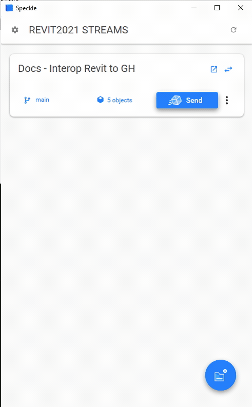
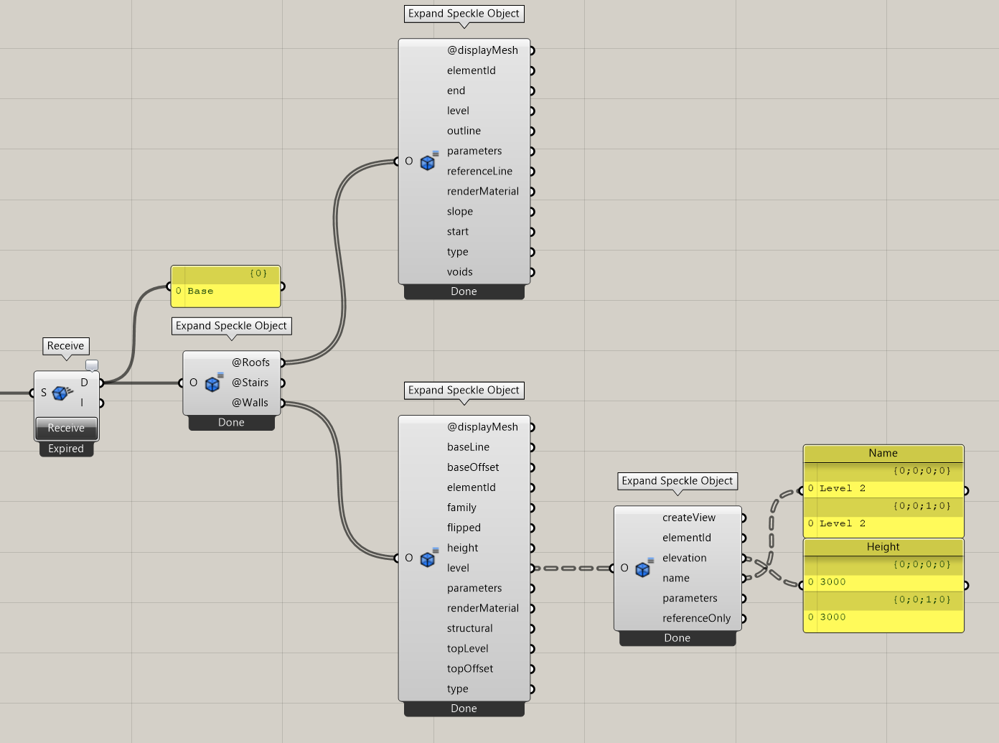
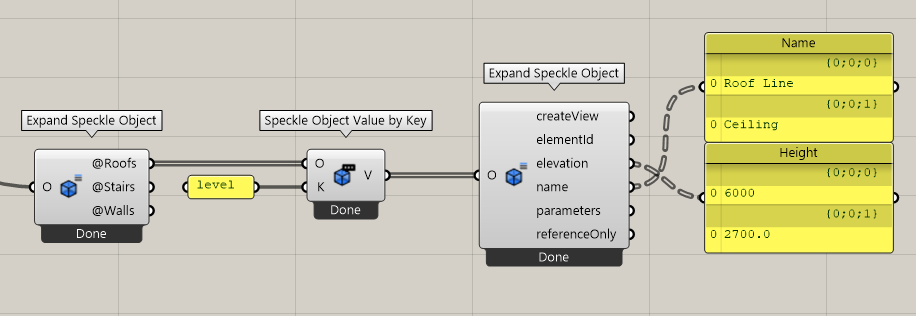
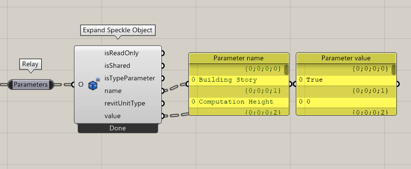

# Revit ➡ Grasshopper

>**Level:** intermediate
>
>**Author:** Alan
>
>**Software used:** Revit 2021, Grasshopper for Rhino 7

You can stream _Revit_ native elements to _Grasshopper_ using Speckle! In this guide, we will send different types of Revit elements, such as walls, floors, levels, etc. We will also learn how to specify which data will be sent by using _filters_.

## Getting started

Before getting started, check that you have a supported version of Rhino (6 or 7) and Revit (2019-21) and the Speckle 2.0 connectors installed for **Grasshopper** and **Revit**. Then download the Revit and Grasshopper files for this tutorial [here](https://drive.google.com/drive/folders/1xl6X6g7Lestv6krJ-oLDdX8Ch5c1kWa7?usp=sharing)

::: tip
Our Rhino and Grasshopper connectors are independent of each other, unlike in Speckle 1.0. This means you can choose which one is appropriate for you, or install both! 😁
:::

## Sending Revit elements by selection

The _Revit connector_ supports sending a specifc selection to the `Speckle server`. This can be easily done by:

1. Open the `Speckle 2` panel in the `Add-ins` tab, and add a new stream to it.
2. Select any elements you want to share.
3. In the stream card, click the button that says `0 objects`.
4. A pop-up will appear, select either `Set selection` or `Add selection`.

## Sending Revit elements by filter

In addition to sending selected elements, you can also use _filters_ to send specific categories, and even data that cannot be selected, such as project information, views, etc.

All filters work in a similar way:

1. Click the objects selection button, and select `Set/edit objects filter`. A pop-up should appear with some options.
2. Select the desired filter from the filter list (category, view, project info, parameter).
3. From there, just select the categories you want by clicking on their names.
4. Once done, press the `Set filter` button on the pop-up.
5. Now press the `Send` button and wait for it to finish.

Add some elements to the stream via selection or filter and send them to be able to receive them in Grasshopper.

## Receiving Revit elements in Grasshopper

1. First, you will need a new Grasshopper file.
2. Create a `Receive` node, and a panel with the stream url.
3. Connect the panel to the `Receive` node and press the button.
   ::: tip
   When receiving Revit elements in GH, independently of the type of filter/selection used, you will receive a single `Base` object.

   This `Base` object will contain all of the elements organized by type. As with any other `Base` object in Grasshopper, in order to see what's inside we need to _expand it_.

   
   :::

4. Use an `Expand Speckle Object` node and connect it to the received data. It will now display all the different types that were `received`, each in its own output.

5. Some of those may also be `Base` objects, in which case we will need to also _expand them_. You can use as many `Expand Speckle Object` nodes as necessary to get to the data you are looking for.

   

6. Alternatively, if you just need the value of one of the properties, you can use the `Speckle Object Value by Key` and specify in a panel the name of the property you want the value of. It also results in a clearer graph for your GH definitions.

   

### Accessing element parameters

Every Revit object contains a `parameters` list, that holds the data for all the parameters that were assigned in Revit to a specific element.

Parameters are just `Base` objects, so just as we did in the previous section, we'll have to expand them to see their names and values.

Each parameter will expose its name and value, as well as other relevant information such as the value type, and booleans to determine if it's _read only_, _shared_ or a _type_ parameter.

Now you can use your grasshopper nodes to operate on the Revit data inside Grasshopper!

## Known issues

- Under the `beta` release, there is limited support for Solid elements to be sent _from_ Revit _to_ Speckle. Any solid that is not supported will be converted to a `Mesh` instead.

  Speckle 2.0 is currently under `beta`. You can find any known issues on our [GitHub Repo Issues page](https://github.com/specklesystems/speckle-sharp/issues?q=is%3Aissue+is%3Aopen).
