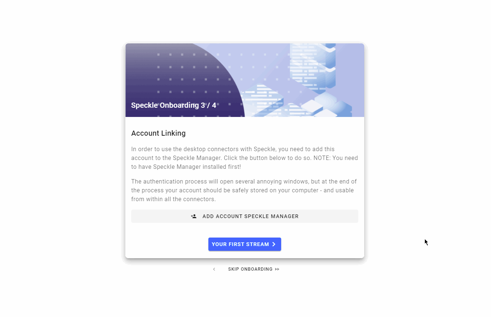

# Speckle Manager

Speckle Manager is a standalone desktop application that helps you manage your Speckle Accounts and Connectors.
**You don't need Manager to be able use the rest of the Speckle platform** (web, api, connectors etc), but it greatly helps!

Throughout this documentation we'll assume you have used Speckle Manager to set up your account and install the connectors. [Alternative methods](/user/manager.md#adding-accounts-manually) are also supported.

::: tip IMPORTANT 🙌
This guide assumes you have access to a **Speckle Server**.
If you don't have one provided by your company, you can use our [free Speckle server](https://speckle.systems/getstarted/).
:::

## Installation

Speckle Manager is available for both Windows and Mac.

Download the latest version of Speckle Manager:

- [Speckle Manager for Windows](https://speckle-releases.ams3.digitaloceanspaces.com/manager/SpeckleManager%20Setup.exe)
- [Speckle Manager for Mac](https://speckle-releases.ams3.digitaloceanspaces.com/manager/SpeckleManager%20Setup.dmg) (currently account management only)

Manager for Windows will automatically update when an update is available, in Mac you have to manually install new versions.


### Preventing Manager from running at Startup

On Windows, Manager automatically launches in the background at Startup so that you can get notified about new versions of the installed connectors as soon as they are released.
If you want to disable it, you can simply do so:

- press the combination `Ctrl + Shift + Esc`
- go on the Startup tab
- find the row with **SpeckleManager** and set its **Status** to **Disabled**


### Uninstallation

On Windows, simply head over **Apps & Features**, find **SpeckleManager** and then click **Uninstall**.


## Adding Accounts

### From Manager

Once you have downloaded the Manager, you'll be able to easily add an account. All you need to do is head to the "Accounts" menu, click the "Add Account" button, and provide your server URL. This will open a browser window where you can log in or register an account on that server and authorise the Manager.


### From the Web

Just visit your profile and click "Add account to desktop manager":


### During Onboarding

You can also add an account directly from Speckle Web as part of the onboarding process you will see after registering on a new server:



:::warning Account problems

Having trouble adding an account? It's probably the firewall. Check our [quick faq guide for possible solutions](/user/FAQs.html#i-cannot-add-an-account-in-speckle-manager)!

:::

### Adding Accounts manually

Using Speckle Manager to handle your accounts and connectors is the recommended way, but if you'd like to do without it a manual flow is also available.

To manually add an account you first need to [generate a token for your account](/dev/tokens-apps).

Then you can proceed to create a `.json` file in `%appdata%\Speckle\Accounts\` with the following data structure:

```json
{
  "token": "YOUR-TOKEN-HERE",
  "serverInfo": {
    "name": "Server Name",
    "company": "Company Name",
    "url": "https://YOUR-SERVE-URL-HERE"
  },
  "userInfo": {
    "id": "YOUR-USER-ID",
    "name": "First Last",
    "email": "firstlast@email.com"
  }
}
```

## Installing Connectors

The Manager also shows you the currently available connectors and allows you to install or remove connectors from your machine. Head into the "Connectors" menu to see what connectors you have installed and which are available to download. You'll also be able to check which version of each connector you have and update a connector as new versions are released.


### Updating Connectors

You will receive a notification in Manager when updates for your installed connectors are available. You can then update them from the Connectors page.

### Uninstalling Connectors

Just head over the Connectors page in Manager and click **Remove**.

## Advanced Settings

You can access the Settings page by clicking the ⚙ icon on the top right of the Manager window.


From here you'll be able to do various things such as clearing your local cache, resetting Manager, allowing beta versions etc.


## Troubleshooting

Having issues with Manager? Send us a message on the [forum](https://speckle.community)!
You can help us troubleshoot your issues by doing the following:

- open the settings page
- click on **Open Dev Tools**, a new window will open
- try reproducing you issue and if you see any text in the Dev Tools send us a screenshot
- if you include your `SUUID` in any bug report, that will help us identify what's going on!

## License

Manager is free to use and will always be.
To use it you need to agree to its [End User License Agreement](https://speckle.systems/eula/).
