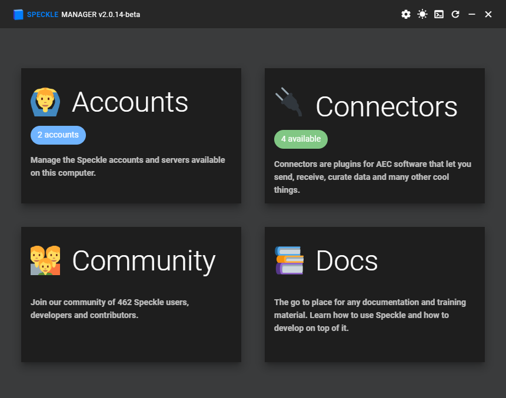

# Zero to Speckle ASAP

Pressed for time? Too impatient to read through a lot of docs? Already familiar with what Speckle is about and want to get started as fast as humanly possible? Here's a lightning fast intro to getting started!

## Manager

Before you can use Speckle, you'll need to download the Speckle Manager. Manager is a desktop application that allows you to add Speckle accounts to your computer and use them with the Desktop Connectors. It is also where you can manage and install the Desktop Connectors.

It is available for both Windows and MacOS and you can find the latest version [here](https://speckle-releases.ams3.digitaloceanspaces.com/manager/SpeckleManager%20Setup.exe).

## Web

The web frontend is your gateway to the server. From here, you can browse server activity, view and manage streams, share your streams with others, visualise your data in the 3D viewer, and more!

### Adding an Account

Whether or not you already have a Speckle account, you can get started by opening up the Manager and heading to the "Accounts" page. From here, click the big "+ Add" button and paste in your server URL. If your company doesn't already have an internal one, you can use our testing server [COMING SOON](). This will open the server in the browser where you can either log in or register to authorise the manager.

### Exploring the Frontend

Once you've authorised the Manager, you are ready to use the Desktop Connectors! However, there is still lots to explore on the web frontend. Beyond basic stream creation and browsing, you can create new branches (and soon - commits!), add or remove collaborators, view and edit your profile, manage your authorised apps, and create personal access tokens to use in your own scripts and apps. If you're interested in experimenting with the API, you can head to your profile and click through the link to the GraphQL Explorer (or go to `your-server.com/explorer`).

## Connectors

The Desktop Connectors are what connect your AEC software to Speckle. They allow you to select, send, and receive data to and from a Speckle server. Currently, we have four official Speckle Connectors: Rhino, Revit, Grasshopper, and Dynamo. We also have WIP connectors for Unity, AutoCAD, and Civil3D.

### Installation

The official connectors can be installed through the "Connectors" page of the Speckle Manager. Simply select which one you'd like to install from the list, and the Manager will do the work for you.

### Usage

#### Visual Programming

The connectors for Grasshopper and Dynamo are fairly aligned. The most basic components are `Send` and `Receive` which do what they say on the tin. They use the default account you've set in Speckle Manager, though there is also an `Account` component to switch accounts.

You also get components to `Create`, `Get`, `Update`, and `Delete` streams as well as get a `List` of your streams or more `Details` for a stream. Streams can be retrieved by either using the `List` component or the url to the stream or a specific commit.

Finally, there are more advanced components for creating and expanding custom objects, serialisation, and local sending / receiving.

[[ IMAGES HERE ]]

#### Desktop UIs

Applications like Revit and Rhino share the same Desktop UI. The main page displays all the streams that exist in the current file as cards. A card can be either a Sender or Receiver - click the double arrow button on the top right corner of a card to switch between them.

The big blue button in the bottom right corner will let you add an existing stream or create a new one. Once you've added a stream, you'll see a new Sender card on the home screen. You can click the centre "0 objects" button to add objects to the stream using selection or filters. Once you've added objects, you can send by clicking the big blue Send button. If you want to add a commit message, just click the three dots menu to the right of the Send button.

Clicking on a stream card will let you edit it's name and description, add collaborators, or remove the stream from the file.

A Receiver has a commit selection button in the centre instead of an objects selection button. This button opens a menu that lets you choose if you want to receive a specific commit or just the latest commit.

#### Further Reading

For information on using specific connectors, check out the [Desktop Connectors](/user/connectors) section of the User Guide.

If you'd like more detailed step-by-step guides for sending data from AEC Software A to AEC Software B, check out our [Interoperability Guides](/user/interop-gh-revit)

## Conclusion

That's all, folks! You are now successfully set up and have the tools to send and receive your data using Speckle. If you need further guidance on anything we covered here, head over to the more detailed [User Guide](/user/). If you want to learn more about the code side of things, the [Dev Docs](/dev/) should be your next stop. If you're looking for more in-depth reading on how Speckle does its Speckling, have a browse through the additional sections below.

If you're enjoying Speckle, have any questions, or would like to share any feedback or suggestions, please drop by our [Community Forum](https://speckle.community/) and join the conversation.
