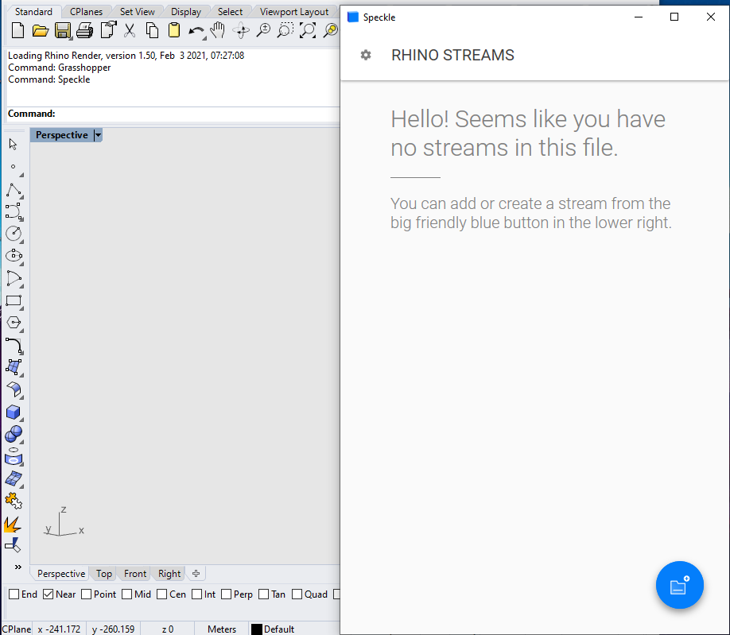
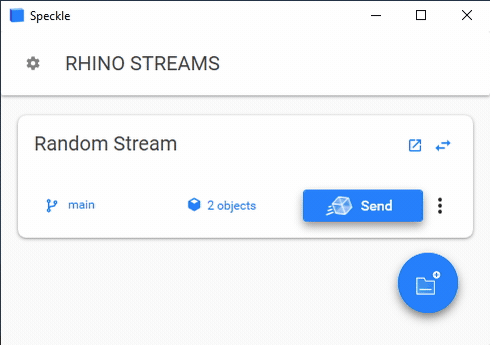
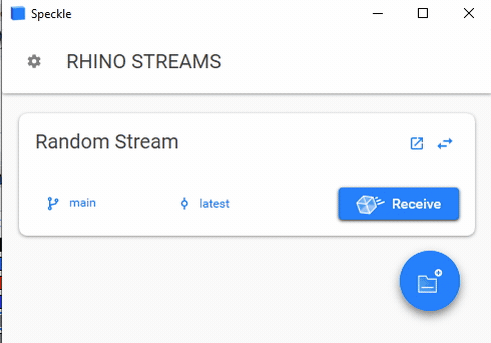
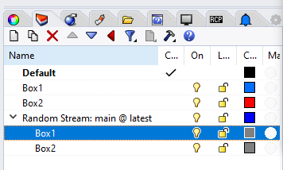

# Rhino

Speckle currently supports McNeel Rhino 6 and 7.

## Getting Started

To install this connector and add your Speckle account proceed by following the instructions in [Speckle Manager](/user/manager).

Once installed you can find the connector by running the `Speckle` command in Rhino. This should open a new pop-up window with the [Desktop UI](/user/ui.md)



> Do not confuse the `Speckle` command with the `SpecklePanel` command, which is for the previous version of Speckle.

## User Interface

::: tip IMPORTANT 🙌

This connector uses our shared Desktop UI. Read up on general guidelines for usage in the [Desktop UI section](/user/ui).

:::

## Basic usage

Once the Desktop UI panel is open, go ahead and create a new stream (or add an existing one) to the current file. Once the Rhino `.3dm` file is saved, the streams associated with that file will be saved too.

### Sending

In order send your objects, we first need to specify the objects we would like to send.
This can be done either by selection or by filtering data by layers.


Select the objects you want to send in Rhino, and then click the button that says `0 objects` in the Speckle Panel. A drop-down will appear; from the options select `Set selection`.


Once that is done, the button that was previously indicating `0 objects` should now display the total count of objects that were selected.


Once that is done, press the `Send` button. You should see a progress bar and, once completed, a success message.



> Notice that, when sending from Rhino, the layer structure will be replicated as `Base` object properties, which can then be recreated on the receiving end.

### Receiving

In order to receive data from a Speckle stream, we will first need to add that desired stream into our Speckle DesktopUI panel. If the stream already exists on the server it will automatically be added in _receiver mode_.


Once the stream has been added go ahead and hit the `Receive` button. This will display a progress bar (just like the sending operation) and, if successfull, will add the received objects to the current document.



In order to prevent overriding existing layers/objects in the file, all received objects will be placed in a nested layer structure.

This structure will contain all the layers. that the sent objects were placed to, with a parent layer with a name in the format `<STREAM_NAME>: <BRANCH_NAME> @ <COMMIT>`.



In the following screenshot, you can appreciate the difference between:

1. the original layers of the sent objects,
2. and the layers created by Speckle when receiving the data back;

as well as the overlapping received objects(gray) with the original objects (blue and red).


## Supported elements

Almost all geometric elements are supported by the Rhino connector. This includes:

| Geometry       | Send    | Receive | Status        |
| -------------- | ------- | ------- | ------------- |
| Point          | x       | x       | `Complete`    |
| Line           | x       | x       | `Complete`    |
| Plane          | x       | x       | `Complete`    |
| Arc            | x       | x       | `Complete`    |
| Circle         | x       | x       | `Complete`    |
| Ellipse        | x       | x       | `Complete`    |
| Polyline       | x       | x       | `Complete`    |
| Polycurve      | x       | x       | `Complete`    |
| Spline         | x       | x       | `Complete`    |
| Nurb Surface   | As Brep | x       | `Complete`    |
| Brep           | x       | x       | `Complete`    |
| Extrusion      | x       | As Brep | `Complete`    |
| Mesh           | x       | x       | `Complete`    |

| BuiltElement   | Send    | Receive | Status        |
| -------------- | ------- | ------- | ------------- |
| View           | x       | x       | `Complete`    |
| ModelCurve     |         | As Curve| `Complete`    |
| DirectShape    |         | As Mesh | `Complete`    |

| Other          | Send    | Receive | Status        |
| -------------- | ------- | ------- | ------------- |
| RenderMaterial | x       |         | `In Progress` |
| BlockInstance  | x       | x       | `Complete`    |
| BlockDefinition| x       | x       | `Complete`    |

> We fully support sending BREPs from Rhino <-> Rhino, and Rhino <-> Revit with some limitations imposed by the Revit API. 

### Unsupported elements

Many non-geometric elements and any geometric element not listed above, such as text tags, hatches, etc... are not supported. Nested blocks are not supported at this time.

## Schema Builder

Speckle 2.0 gives you the option of streaming objects as `base` geometry from Rhino to Revit, or directly into Revit families as BuiltElements through the Rhino schema builder commands.


### Features

Currently, direct conversions are available for the following types:

| Base Geometry            | BuiltElement schemas            | Revit type |
| ------------------------ | ------------------------------- | ---------- |
| Planar surface           | `Wall` `Floor` `Ceiling` `Roof` |            |
| Planar polysurface       | `Wall`                          |            |
| Planar and nurbs surface | `FaceWall`                      | x          |
| Line                     | `Column` `Beam`                 |            |
| Brep / extrusion         | `DirectShape`                   | x          |
| Mesh                     | `DirectShape`                   | x          |

### Walkthrough

Stream your Rhino objects directly into Revit as BuiltElements! Rhino to Revit interop uses a custom Speckle Attribute User Text (AUT) string to determine an object's schema before sending streams. AUTs are modified with two commands:

- `ApplySpeckleSchema` gives you options for adding AUTs to model objects
- `RemoveSpeckleSchema` removes schema AUTs from model objects
  Some schemas have additional parameters that can be manually modified for custom control over parameters like Revit Family or Revit Type.

### Assigning schemas


#### The automagic method

The easiest way to assign schemas to your Rhino objects is to let the Speckle schema builder decide for you!

1. Type `ApplySpeckleSchema` in the command line
2. Select objects for BuiltElements conversion
3. By default, `Automatic` is set to `On`. Press **Enter**!

The algorithm for automatic schema application takes into account object and layer naming before it tries to find the best BuiltElements schema to apply. For example, if an object has _Wall_ in its name, or in the absence of a name, the object is nested in a layer with a name that includes _Wall_, then the automatic method will try to send the object as a Speckle `Wall` element. If the algorithm can't find a BuiltElements type in either the object or layer name, it will analyze the object geometry and try to find the first schema fit based on the object's properties.

**note** `DirectShape` conversions are not assigned during the automagic method. If an XY planar surface does not have a specific schema in its object or layer name, it will default to `Floor`, instead of `Roof` or `Ceiling`.

#### The single schema method

You can assign a specific schema to selected objects through the single schema method: this method also includes conversions to `DirectShape` and `FaceWall` schemas.

1. Type `ApplySpeckleSchema` in the command line
2. Set `Automatic` to `Off`
3. Select a `Schema` option
4. By default, `DirectShape` is set to `Off`. To send as a DirectShape instead of a native object, set the toggle to `On`.
5. Select objects for schema application, and press **Enter**!

#### Customizing properties

Revit-specific BuiltElements schemas such as `FaceWall` and `DirectShape` can be manually customized with additional properties. By default, these schemas will have a user string with the following formats:

```
FaceWall([family], [type])
DirectShape(Schema, UniqueName)
```

To assign custom values, select your FaceWall or DirectShape object and navigate to its User Attribute Text panel. Double click on the _SpeckleSchema_ entry value and replace the `[]` properties with custom values if you want to assign a specific Revit family or type to your `FaceWall` object. If no changes are made, FaceWalls are assigned to the `Basic Wall` type by default. For DirectShapes, a unique shape name is automatically generated, but can be changed to a custom string if desired.

### Removing schemas

Removing schemas from Rhino objects is super easy:

1. Type `RemoveSpeckleSchema` in the command line
2. Select objects to remove schemas from
3. Press **Enter** - Speckle AUT strings are now deleted from all selected objects!

## Things to keep in mind

This section is work in progress 🚧 ! Please check back again soon 😃
