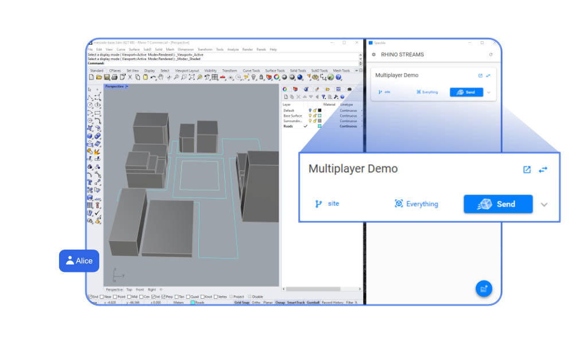
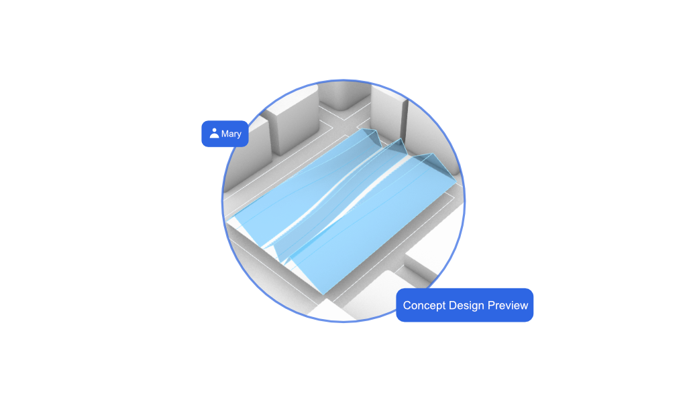
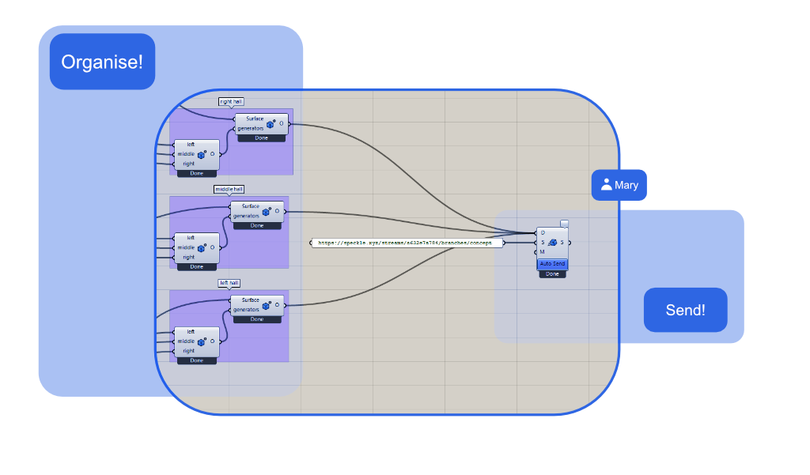
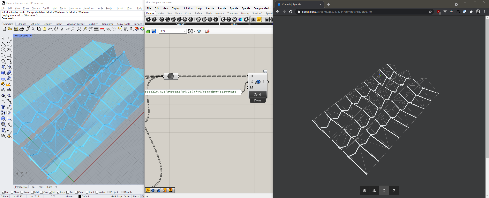
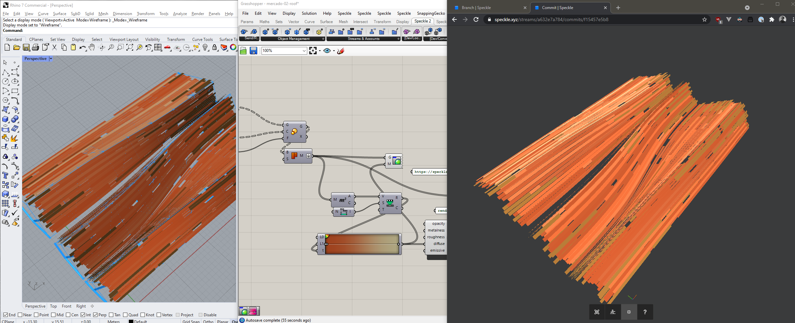
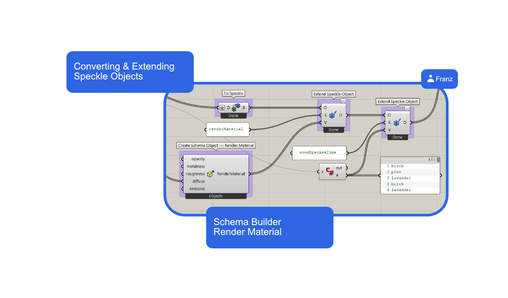
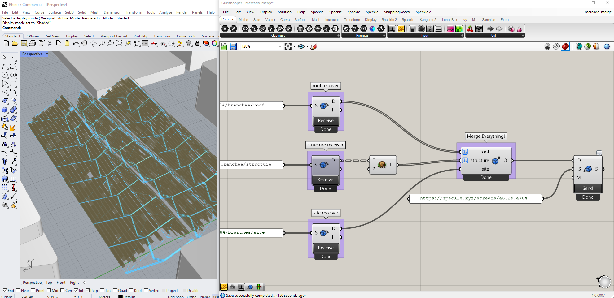
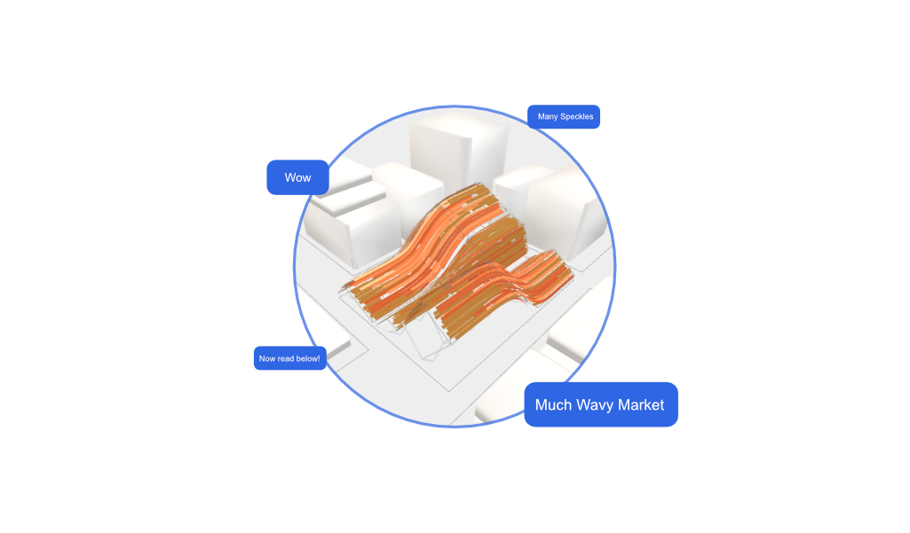

# Collaborative Data Informed Design Workflows With Rhino and Grasshopper

> **Level:** intermediate
>
> **Author:** Dim
>
> **Software used:** Grasshopper and Rhino 7

We're going to create a simple collaborative workflow with Rhino, Grasshopper and Speckle. We're assuming a design process in which three or more persons are collaborating on the design of a market hall. Here's a diagram of the workflow:

:::tip Curious about the final result?

Check it the [model out right here in your browser](https://speckle.xyz/streams/a632e7a784/commits/a4427aede3)!

:::

> If you're tired of reading things, you can find a video tutorial down below. We use a different sample model, but the principles are the same!
> Otherwise, just skip it and follow along here. 

<iframe width="100%" height="100%" style="position: absolute;" src="https://www.youtube.com/embed/drLcMwb6W8M" title="YouTube video player" frameborder="0" allow="accelerometer; autoplay; clipboard-write; encrypted-media; gyroscope; picture-in-picture" allowfullscreen></iframe>

How are we going to structure this? Simple! First off, we're going to create a new stream with four separate branches that can match four different sections of a typical design process. Each colleague will be pushing their data to one of these branches:  

1. Site Branch (Alice - Project Manager) 
2. Concept Branch (Mary)
3. Structure Branch (Bob)
4. Roofing Branch (Franz)

Alice, our project manager, will use the default branch, "main", to hold the combined data - somewhat of a release branch, where information is "stable". 

Here's a quick video of how to setup this stream:

[stream creation](./img-collab-gh/stream-creation.mp4)

:::warning Want to follow along?

The base files are [right here](https://drive.google.com/drive/folders/1yUXmP_IPH2Ek3XyLR5XaZ5zBfLvzr3JU?usp=sharing).  

Do note that you will not be able to send to the same stream, as you do not have write access to it. You can just [create one on our server](https://speckle.systems/getstarted) and get going!

:::

## **Step 0**: Sending the Site & Surroundings to Speckle

We'll assume the site is modelled in Rhino directly - consequently, Alice will use the Rhino connector to send the data out. To open it in Rhino, simply type Speckle in the command line. 

In this step, Alice is just sending "everything" out that's in the file. You might want to curate what you send, but it's the easiest option. To do so, first add the stream you have just created to the connector. Then swap it to a sender, and set it's object filter to "All". Finally, Alice clicks **Send**!

:::tip 

#### Here's how the site [looks like in your browser](https://speckle.xyz/streams/a632e7a784/branches/site). 

:::

## **Step 1:** Conceptual Modelling

Before starting to work on her concept design, first pulls in the site information that Alice is keeping updated on the "site" branch. 

[stream creation](./img-collab-gh/site-receive.mp4)

As she wants to always have the latest version of the site model, Mary selects the "latest" option in the receiver rather than specifying an individual commit. This means that whenever Alice will update the site information, she will be notified of the change in real-time! 

Mary's Grasshopper definition takes a surface and cuts it into three main sections, creating a flowing roof-like structure describing three separate market halls. We've kept the design part rather brief for the purposes of this tutorial 😇

When sending the data out, Mary is organising it a bit, rather than just "sending it". She is discussed with Bob and Franz in what way it would be useful for them down the line, when devising a structural system (Bob) and the roofing solution (Franz) and decided to separate the generator curves from the actual surfaces. She does this by creating and nesting a series of custom speckle objects that describe each hall section:

TIP: When plugging data directly into a grasshopper sender and receiving it back out again, Speckle respects your tree structures; that might be enough!

Lastly, Mary sends her work in the "concept" branch. In Grasshopper, to do so, the easiest way is to simply copy paste the branch url from online and plug it into the "S" input port of the sender. 

## **Step 2:** Structure Design

Bob will now start designing a structure for the market halls. To start, he will receive the surfaces from the conceptual modelling branch. Here's a quick video of the process:   

[receiving the data for structure generation](./img-collab-gh/structure-receive.mp4)

Notice how, when Bob just received the data, there's no visible geometry. That's because it comes from upstream in a custom structure that needs to be expanded first to reach the actual geometry. 

Great - now Bob has a bunch of generator curves, as well as the original surfaces of the roof. From here onwards, we can start designing our structure! Once done, Bob sends his structural design to the "structure" branch of the stream. 

:::tip Want to actually see what's going on?

Check out Bob's (ahem, Dim's) [latest commit](https://speckle.xyz/streams/a632e7a784/commits/6b73f03740)!

:::

## **Step 3**: Creating the Roof

Franz is tasked with coming up with a cladding solution for our design. For this, he need to receive both the structure, as well as the original surfaces. Franz can easily receive the data from both the conceptual modelling branch, as well as from the structural branch - and based on that, start creating different cladding versions. He just creates two receivers, one for the "concept" branch and one for the "structure" branch. 

Franz comes up with cladding design that's reliant on several species of wood, all with different nuances. To communicate this, he adds custom render materials to each individual panel to reflect the intention he's going for. 

:::tip Want to see for yourself? 

[Click here](https://speckle.xyz/streams/a632e7a784/commits/f15457e5b8) to see the roof design preview.

:::

### Extending Speckle Objects: Colours & More!

Moreover, he attaches a field to each panel's geometry containing a string that describes the wood type. How does he do the above? It's quite simple! 

First, he converts each panel to a Speckle object. Then, using the Extend Speckle Object component, he adds two separate fields - one called renderMaterial (he populates this using by generating a render material object using the Schema builder component - this will be picked up by the online renderer) and another one, called woodSpeciesType, which he populates with the name of the wood for each panel. 

## **Step 4:** Bringing It All Together

### Merging Data

Alice, our project manager, is in charge of this stage of the project. As such, she will want to verify and release data down the line before it goes out to other contractors or different teams. 

Her main task is to coordinate and merge the data from the structure, roofing and the site branches and push it to main, where it can be easily referred to in the future. How does she do that? Well, there's more ways than one. She could receive and bake all the data streams in Rhino, check that they are in good order, and then send them out again. 

Alternatively, she can also receive all this data in Grasshopper and merge it there before sending it out to the main branch: 

Using the online interface, Alice as well will assign that commit a specific "commit message", or description, that matches the project's delivery naming conventions and specifications. Here's how to do it: 

[renaming a commit](./img-collab-gh/commit-rename.mp4)

> Check out the final result here: [https://speckle.xyz/streams/a632e7a784/commits/a4427aede3](https://speckle.xyz/streams/a632e7a784/commits/a4427aede3)

### Updates

As you know, things can change during the design phase. One nifty advantage of using Speckle is that you can have real-time updates as they do! 

Each receiver will notify users when there's a newer commit on a given branch; moreover, if set to "auto-receive", it will automatically pull that data down! Here's a quick video of a live-update session:

[live updates](./img-collab-gh/live-updates.mp4)

:::tip 

Note: sometimes it's better *not* to have live updates. I mean, who would want to publish design data out before it's ready? That's why the default behaviour of Senders and Receivers is set to "manual": publish data when you're ready drafting; pull new data in at your leisure! 

:::

## Key Takeaways

This quick tutorial taught you one of the ways in which you can use Speckle in a collaborative design environment in Rhino and Grasshopper. 

- You've gotten familiar with the **basics** of the Rhino and Grasshopper connectors, and some **advanced features** such as adding custom properties to objects.
- You've used stream **branches** to separate the design tasks amongst a team of architects and engineers.
- You've also seen how to **structure data** so that downstream actions can be easier to achieve.
- Lastly, you've **merged** multiple data sources to create a master model to "pin" a version of your design.

If you have questions, suggestions, please give us a [shout on the forum](https://speckle.community)!