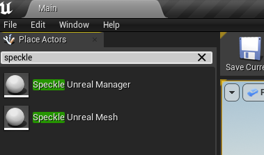
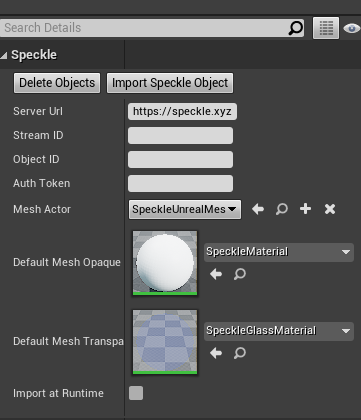
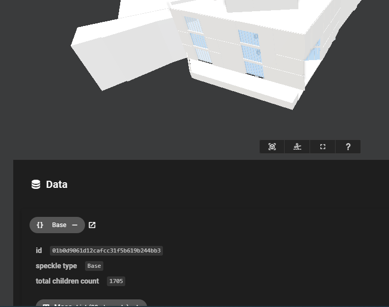

# Unreal

Our Unreal connector is in an early stage of development.
It supports receiving meshes from Speckle in Unreal Engine 4.

Github repository: [https://github.com/specklesystems/speckle-unreal](https://github.com/specklesystems/speckle-unreal)

<video width="761" height="454" controls>
  <source src="https://user-images.githubusercontent.com/2551138/114720093-61403e00-9d40-11eb-8045-6e8ca656554d.mp4" type="video/mp4">
  Your browser does not support the video tag.
</video> 

## Installation
The Unreal connector is package as an Unreal Engine 4 plugin that is available on Github. To use it in your project:
1. Download and extract the `speckle-unreal` repository archive from [https://github.com/specklesystems/speckle-unreal/archive/refs/heads/master.zip](https://github.com/specklesystems/speckle-unreal/archive/refs/heads/master.zip) (or clone the repository using `git` tools)

2. Go to the `SpeckleUnrealProject/Plugins` directory and copy the `SpeckleUnreal` plugin directory to your project's `Plugins` directory (if your project directory doesn't contain a directory called `Plugins`, you should create it)

   
3. Open your UE4 project (or restart the editor if you already have it opened). This will build the plugin in your environment.

👉 Your project can now use the Speckle plugin

## Usage
The plugin includes an actor type named `Speckle Unreal Manager` that you can use to import objects from Speckle.

Here is how to use it:

1. In the `Place Actors` sidebar, search for Speckle Unreal Manager and add it to the world.

2. Select the `SpeckleUnrealManager` instance in the `World Outliner` sidebar and use the options presented in the `Speckle` category

3. Currently, we require an explicit ObjectID to import. You can explore the objects in a stream by using the Speckle Web Interface of the Speckle server that you use.

4. If your Speckle Stream is not public, you must generate a [Personal Access Token](/dev/apps-auth.html#personal-access-tokens) and set it in the `Auth Token` configuration option.

::: tip IMPORTANT
   Treat your Personal Access Token as a password. If someone else has access to your auth token, they can access to your Speckle data.
:::

5. After you set up the import parameters, just click the `Import Speckle Object` button. The specified object and all its children will be important as mesh actors.

## General Notes

This plugin is in early stages of development. If you have any thoughts or suggestions about this plugin, you're welcome to [discuss them in our forum](https://speckle.community/).
