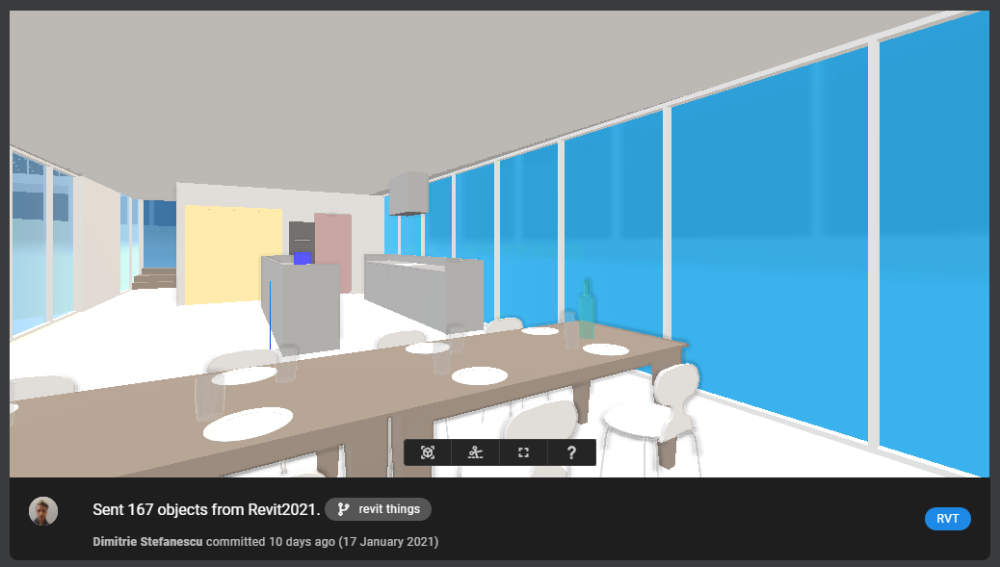

# Speckle Web

If you don't already have a Speckle 2.0 Server to use, this section will walk you through how to get a dev server up and running locally.

## Setup

### Dependencies

There are a few dependencies you'll need before you can set up your local server:

**Node**

We recommend using version 12.

**Postgres**

You can get Postgres for any platform [here](https://www.postgresql.org/download/). You'll also probably want a GUI like [PgAdmin](https://www.pgadmin.org/download/).

**Redis**

If you are on MacOS, you can download Redis [here](https://jpadilla.github.io/redisapp)

For Windows, you can download Redis [here](https://github.com/microsoftarchive/redis/releases/tag/win-3.0.504)

**Lerna**

This one is easy - all you need to do is open up a terminal and run the following:

```
npm install --global lerna
```

### Initial Configuration

Now you're ready to set up your local Speckle Server! Go ahead and clone the repo [here](https://github.com/specklesystems/speckle-server/).

This monorepo contains the different Speckle Web components: the 3D Viewer, the Frontend, and the Server. We'll need to do a bit of setup to each of these components which can be found in the `packages` folder.

#### Viewer



This is the extension that lets you display your data from Speckle in 3D. To set this up, head into the `packages/viewer` folder and run these two commands:

```
npm install
npm run build
```

#### Frontend


This is the frontend application you'll use to view, share, and manage your Speckle data.

To set this up and hook it up to the viewer and the server, run the following command:

```
lerna bootstrap
```

#### Server

While that's doing it's thing, you can pop over to `packages/server`. This is the Server - the backend application that handles your Speckle data. 

In this folder, you'll see a file called `.env-example`. Copy this file, rename it to simply `.env` and fill in the blanks. Make sure this new `.env` file is in the `/server` folder alongside the example file.

By now the frontend should be finished bootstrapping. You're ready to power up! 

## Running Locally

Here's all you need to do to start up you local Speckle Server:

1.  Make sure you've got both Redis and Postgres running. You'll also want to create a Postgres database called `speckle2_dev`.
2.  Head into the `packages/frontend` folder and run `npm run dev`
3.  Finally, in `packages/server` run `npm run dev`

You should now see the shiny new frontend at [`localhost:3000`](http://localhost:3000)! Also check out [`localhost:3000/graphql`](http://localhost:3000/graphql) to have a play with the API in the GraphQL explorer.

